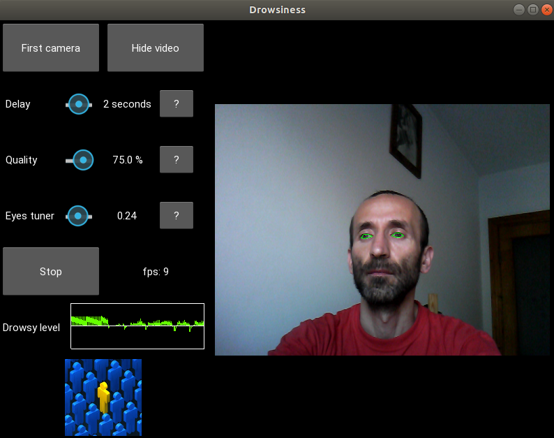

# Drowsiness
* Detects person's activity
* https://youtu.be/7Tzy7Z1ZQxg

### Prerequisites
* python 3
* Kivy v1.11.1
* opencv v2 or v3 or v4
* dlib v19
* numpy (any version)
* scipy (any version)
* imutils (better the last version)
* at least one web-cam

### Run application
* to run application in terminal: python main.py

### Application preentscreen

### Links
* Who is interesting with computer vision I recommending this place: www.pyimagesearch.com

### Author
* MarsLviv - *matsars@gmail.com*
